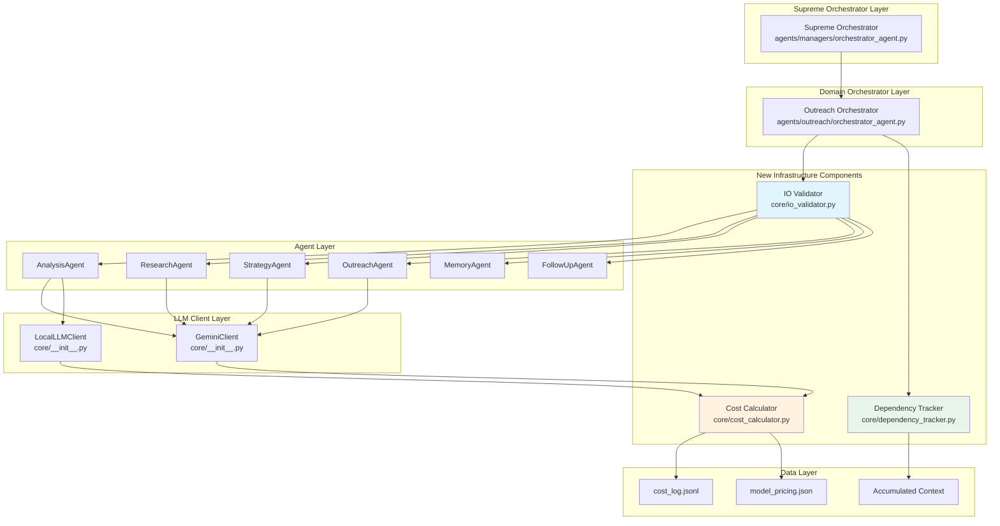
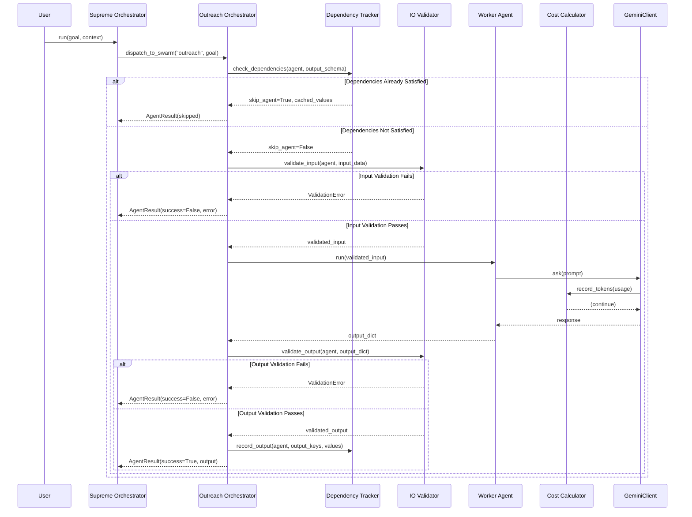
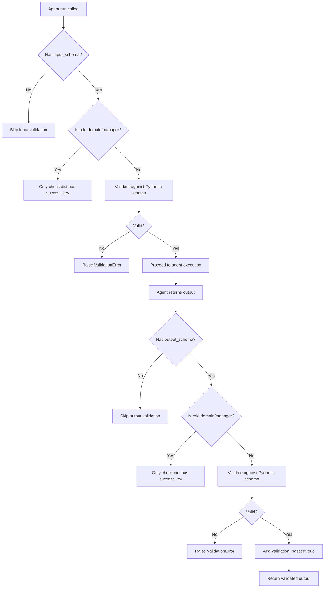
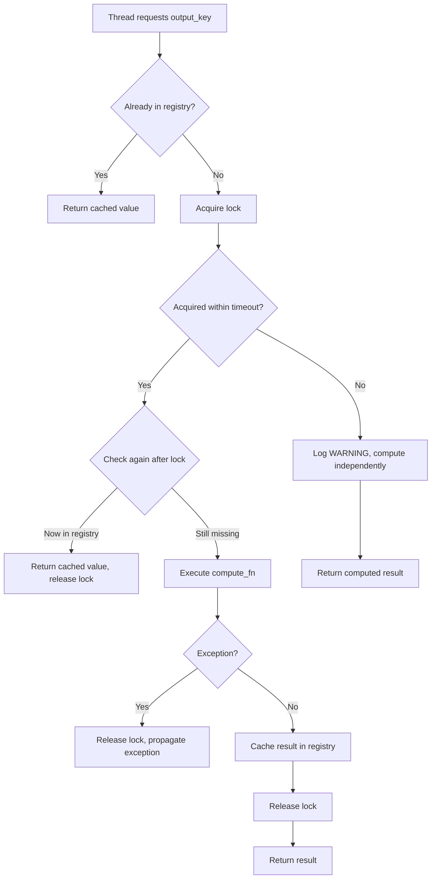
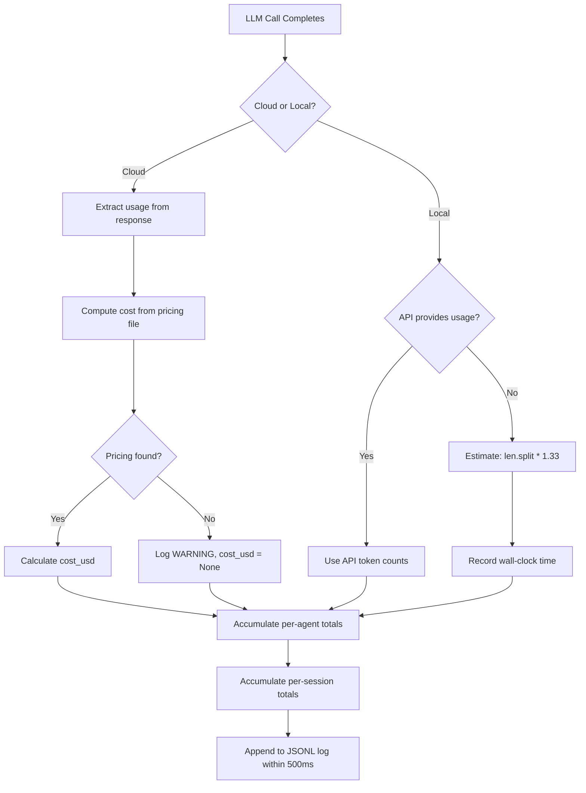

# Design Document: Agent I/O Validator and Cost Tracker

## Overview

This document describes the technical design for three tightly coupled subsystems in the UltraSwarm multi-agent framework:

1. **I/O Validator** — Schema-based validation for agent inputs and outputs using Pydantic models
2. **Orchestrator Dependency Tracker** — Dependency-aware scheduling with critical section locking
3. **Cost/Token Calculator** — Token tracking and cost calculation for cloud and local models

### Design Goals

- **Non-invasive integration**: Existing agents work without modification; validation is opt-in via decorator
- **Graceful degradation**: Missing schemas, missing pricing files, and tracking failures never crash the system
- **Observable**: Rich logging and structured error messages for debugging
- **Performant**: Validation completes within 5-20ms for typical schemas; minimal overhead on the hot path

---

## Architecture

### High-Level Component Diagram



### Component Interaction Flow



---

## Components and Interfaces

### 1. I/O Validator

The I/O Validator provides schema-based validation for agent inputs and outputs using Pydantic models.

#### Module: `core/io_validator.py`

**Key Classes:**

- `ValidationError` — Exception raised when validation fails, with structured error details
- `validated_agent()` — Decorator that wraps agent `run()` methods with validation

**Key Functions:**

- `_validate_input(input_data, schema)` — Validates input dict against Pydantic schema
- `_validate_output(output_data, schema)` — Validates output dict against Pydantic schema
- `validate_literal_field(value, allowed_values, field_name)` — Validates Literal type fields

#### Validation Flow



---

### 2. Orchestrator Dependency Tracker

The Dependency Tracker manages dependency-aware scheduling and critical section locking.

#### Module: `core/dependency_tracker.py`

**Key Classes:**

- `OutputEntry` — Record of an agent output stored in the registry (value, producing_agent, timestamp)
- `DependencyTrackerConfig` — Configuration with `lock_timeout_seconds` (default 30s, min 1s, max 300s)
- `DependencyTracker` — Main tracker class with session management and locking

**Key Methods:**

- `start_session(session_id)` — Initialize a per-session registry
- `end_session(session_id)` — Clear session registry when session ends
- `check_dependencies(session_id, output_schema, provides)` — Check if required outputs exist
- `record_output(session_id, agent_name, output, output_schema)` — Store agent outputs with provenance
- `acquire_lock(session_id, output_key)` — Get or create a lock for an output key
- `critical_section(session_id, output_key, compute_fn)` — Execute with lock protection

#### Critical Section Flow



---

### 3. Cost/Token Calculator

The Cost Calculator tracks token usage and computes costs for cloud and local models.

#### Module: `core/cost_calculator.py`

**Key Classes:**

- `ModelPricing` — Pricing info for a model (input/output price per token)
- `TokenUsage` — Record of a single LLM call's token usage
- `TokenReport` — Aggregated token usage report for a session
- `CostCalculator` — Main calculator class with tracking and reporting

**Key Methods:**

- `record_cloud_call(session_id, agent_name, model_name, prompt_tokens, completion_tokens)` — Record cloud model usage
- `record_cloud_error(session_id, agent_name, model_name)` — Record failed cloud call
- `record_local_call(session_id, agent_name, model_name, prompt_text, response_text, time_seconds)` — Record local model usage
- `record_local_error(session_id, agent_name, model_name, time_seconds)` — Record failed local call
- `generate_report(session_id)` — Generate TokenReport for a session

#### Token Recording Flow



---

## Data Models and Schemas

### Model Pricing Configuration

**File:** `config/model_pricing.json`

```json
{
  "models": {
    "gemini-2.5-flash": {
      "input_price_per_token": 0.000000075,
      "output_price_per_token": 0.0000003,
      "currency": "USD"
    },
    "gemini-2.0-flash": {
      "input_price_per_token": 0.0000001,
      "output_price_per_token": 0.0000004,
      "currency": "USD"
    },
    "gemini-1.5-pro": {
      "input_price_per_token": 0.00000125,
      "output_price_per_token": 0.000005,
      "currency": "USD"
    }
  }
}
```

### Agent Schema Definitions

**File:** `agents/outreach/schemas.py`

```python
from typing import Literal, Optional
from pydantic import BaseModel, Field

class AnalysisAgentInput(BaseModel):
    message: str = Field(..., min_length=1)
    context: Optional[dict] = None

class AnalysisAgentOutput(BaseModel):
    Emotion: Literal["Happy", "Curious", "Neutral", "Frustrated", "Angry"]
    Interest_Level: Literal["None", "Low", "Medium", "High"]
    Intent: Literal["Wants information", "Wants pricing", "Wants a demo", 
                    "Wants a meeting", "Rejecting", "Asking questions", "Requesting callback"]
    Objections: Literal["Too expensive", "Busy", "Already using another provider",
                        "No budget", "Wrong contact", "Not interested", "None"]
    Urgency: Literal["Immediate", "Soon", "Future", "Unknown"]
    Recommended_Next_Action: Literal["Reply immediately", "Send pricing", "Send case study",
                                     "Schedule meeting", "Follow up later", "Escalate to human", "Stop outreach"]
    Campaign_Stage_Recommendation: Literal["ADVANCE", "PAUSE", "ESCALATE_TO_HUMAN", "STOP"]
    Confidence: float = Field(..., ge=0.0, le=1.0)
```

### Cost Log Format

**File:** `logs/cost_log.jsonl`

```json
{"agent_name": "outreach_analysis_agent", "model_name": "gemini-2.5-flash", "prompt_tokens": 150, "completion_tokens": 80, "total_tokens": 230, "cost_usd": 0.0000345, "time_seconds": null, "timestamp": "2024-01-15T10:30:00Z", "session_id": "sess_abc123", "error": false}
{"agent_name": "outreach_strategy_agent", "model_name": "gemini-2.5-flash", "prompt_tokens": 420, "completion_tokens": 200, "total_tokens": 620, "cost_usd": 0.0000915, "time_seconds": null, "timestamp": "2024-01-15T10:30:05Z", "session_id": "sess_abc123", "error": false}
```

---

## Integration Points with Existing Codebase

### 1. Integration with `core/__init__.py` (GeminiClient/LocalLLMClient)

The Cost Calculator wraps the existing client instances to record token usage transparently.

```python
# In core/__init__.py - Modified make_client()

def make_client(system_prompt: str, agent_name: str, api_key: str = None, cost_calculator: CostCalculator = None):
    """Factory function for creating agent clients with optional cost tracking."""
    use_local = os.getenv("USE_LOCAL_LLM", "").lower() in ["true", "1", "yes"]
    
    if use_local:
        client = LocalLLMClient(system_prompt=system_prompt, agent_name=agent_name)
    else:
        client = GeminiClient(system_prompt=system_prompt, agent_name=agent_name, api_key=api_key)
    
    # Wrap with cost tracking if calculator provided (Requirement 11.3)
    if cost_calculator:
        return CostTrackingWrapper(client, cost_calculator, agent_name)
    
    return client
```

### 2. Integration with `agents/outreach/orchestrator_agent.py`

The Outreach Orchestrator integrates the Dependency Tracker and IO Validator.

```python
# In agents/outreach/orchestrator_agent.py

class OrchestratorAgent:
    def __init__(self, ...):
        # ... existing init ...
        self._dependency_tracker = DependencyTracker()
        self._io_validator = IOValidator()
    
    def decide_next_step(self, state: SwarmState, last_event: str) -> Dict[str, Any]:
        # Check dependencies before dispatching (Requirement 5.2)
        agent = self._get_agent_for_state(state)
        
        all_satisfied, cached_values = self._dependency_tracker.check_dependencies(
            session_id=state.contact_id,
            output_schema=getattr(agent, "output_schema", None),
        )
        
        if all_satisfied:
            # Skip agent, use cached values (Requirement 5.3)
            return {
                "next_agent": "None",
                "action": f"Dependencies satisfied: {list(cached_values.keys())}",
                "rationale": "Output already computed",
                "cached_values": cached_values,
            }
        
        # ... proceed with normal dispatch ...
```

### 3. Integration with `core/base_agent.py`

The BaseAgent class gains optional schema attributes.

```python
# In core/base_agent.py

class BaseAgent:
    """Dynamically loads capabilities from JSON skills."""
    
    # New optional class attributes for schema validation
    input_schema: Optional[Type[BaseModel]] = None
    output_schema: Optional[Type[BaseModel]] = None
    
    def execute_task(self, task: str, context: Optional[Dict[str, Any]] = None) -> ExecutionResult:
        # Existing implementation remains unchanged
        # Validation is applied via decorator, not here
        ...
```

---

## Error Handling Strategies

### 1. Validation Errors

| Scenario | Handling | Result |
|----------|----------|--------|
| Missing required input field | Raise `ValidationError` with field name | Orchestrator logs ERROR, returns `AgentResult(success=False)` |
| Wrong type for input field | Raise `ValidationError` with expected/received | Same as above |
| Invalid Literal value | Raise `ValidationError` with allowed values | Same as above |
| Agent output not a dict | Raise `ValidationError` | Same as above |
| Missing required output field | Raise `ValidationError` | Same as above |
| Manager agent output missing "success" | Log DEBUG, set `validation_passed: false` | Output returned with flag |

### 2. Dependency Tracker Errors

| Scenario | Handling | Result |
|----------|----------|--------|
| Tracker raises exception during check | Log WARNING, return `skip_agent=False` | Agent executes normally |
| Lock acquisition timeout | Log WARNING, release lock | Thread computes independently |
| Exception in critical section | Release lock via `finally` | Propagate exception to caller |

### 3. Cost Calculator Errors

| Scenario | Handling | Result |
|----------|----------|--------|
| `model_pricing.json` missing | Log ERROR, set all `cost_usd=None` | Token tracking continues |
| Model not in pricing file | Log WARNING, set `cost_usd=None` | Token tracking continues |
| LLM call raises exception | Record with `error=True`, zero tokens | Log entry still created |
| JSONL log write fails | Log ERROR | Execution continues |

---

## Correctness Properties

*A property is a characteristic or behavior that should hold true across all valid executions of a system—essentially, a formal statement about what the system should do. Properties serve as the bridge between human-readable specifications and machine-verifiable correctness guarantees.*

### Property 1: Role-Based Validation Behavior

*For any* agent, the validator SHALL apply full Pydantic schema validation when the agent's role is NOT `"domain"` or `"manager"` and schemas are declared; when the role IS `"domain"` or `"manager"`, the validator SHALL only verify the output contains a `"success"` key.

**Validates: Requirements 1.2, 1.3, 1.5**

### Property 2: Validation Output Flag Consistency

*For any* agent with a declared schema, when validation succeeds, the output dict SHALL contain `"validation_passed": true` with no `"validation_errors"` key; when validation fails, the output SHALL contain `"validation_passed": false` with a non-empty `"validation_errors"` list.

**Validates: Requirements 1.6, 1.7**

### Property 3: ValidationError Structure Completeness

*For any* validation failure (input or output, missing fields, type mismatch, or Pydantic validator failure), the raised `ValidationError` SHALL contain a non-empty `errors` list where each entry has `field`, `expected`, and `received` keys.

**Validates: Requirements 2.1, 2.2, 2.3, 3.1, 3.2, 3.3**

### Property 4: Schema Round-Trip Preservation

*For any* valid output dict that passes schema validation and round-trip serialization (Pydantic model instantiation followed by `.model_dump()`), the resulting dict SHALL contain the same field names, types, and values as the original.

**Validates: Requirements 3.6**

### Property 5: Literal Value Validation

*For any* schema field declared as a `Literal` type, the validator SHALL verify the supplied value is one of the declared allowed literals and raise `ValidationError` with the field name and invalid value when the check fails.

**Validates: Requirements 4.9**

### Property 6: Dependency Check Correctness

*For any* session and agent with an `output_schema`, `check_dependencies()` SHALL return `all_satisfied=True` if and only if all schema field names exist in the registry with non-null values; when satisfied, the returned `cached_values` dict SHALL contain all schema field names.

**Validates: Requirements 5.2, 5.3, 5.4**

### Property 7: Session Registry Lifecycle

*For any* session, the registry SHALL be empty immediately after `start_session()` is called, and SHALL be empty after `end_session()` is called.

**Validates: Requirements 5.1**

### Property 8: Output Provenance Tracking

*For any* recorded output, the registry entry SHALL store the producing agent's name alongside the value, so that `get_provenance(session_id, output_key)` returns the agent name.

**Validates: Requirements 5.5**

### Property 9: Critical Section Lock Guarantee

*For any* call to `critical_section()`, the lock SHALL be released after the function completes—whether it returns normally, raises an exception, or times out; when a thread acquires a lock and computes successfully, other waiting threads SHALL receive the cached result without re-executing.

**Validates: Requirements 6.2, 6.3, 6.4, 6.7**

### Property 10: Cost Calculation Precision

*For any* cloud model call where pricing is defined, the computed `cost_usd` SHALL equal `(prompt_tokens × input_price + completion_tokens × output_price)` rounded to exactly 8 decimal places.

**Validates: Requirements 8.3**

### Property 11: Missing Pricing Graceful Handling

*For any* cloud model call where the model name is not in the pricing file, `cost_usd` SHALL be `None` and the call SHALL be logged with a `WARNING` without raising an exception.

**Validates: Requirements 8.7, 8.8**

### Property 12: Local Model Token Estimation

*For any* text string, the estimated token count SHALL equal `round(len(text.split()) * 1.33)` when no custom tokenizer is provided.

**Validates: Requirements 9.2**

### Property 13: Session Total Accumulation

*For any* session with multiple agent calls, `generate_report()` SHALL return session totals where `total_tokens` equals the sum of all per-agent `total_tokens`, and `cost_usd` equals the sum of all per-agent `cost_usd` values.

**Validates: Requirements 8.4, 8.5, 9.5**

### Property 14: JSONL Log Append Latency

*For any* token usage record, the append to the JSONL log file SHALL complete within 500ms of the LLM call completing.

**Validates: Requirements 10.9**

---

## Testing Strategy

### Unit Tests

Unit tests verify specific examples, edge cases, and error conditions:

1. **IO Validator Tests**
   - Valid input passes validation
   - Missing required field raises ValidationError
   - Wrong type raises ValidationError with expected/received
   - Manager role bypasses field-level validation
   - Empty dict validation behavior
   - Literal field validation

2. **Dependency Tracker Tests**
   - Session start/end clears registry
   - check_dependencies returns correct satisfaction status
   - Critical section computes only once
   - Lock timeout releases and allows independent computation
   - Provenance tracking records producing agent

3. **Cost Calculator Tests**
   - Cost computed correctly from pricing
   - Missing pricing returns None cost
   - Token estimation matches formula
   - Session totals accumulate correctly
   - JSONL log format is correct

### Property-Based Tests

Property tests verify universal properties across generated inputs:

- **Property 1**: Run 100 iterations with random valid output dicts, verify `validation_passed: true`
- **Property 2**: Run 100 iterations with random invalid inputs, verify error structure
- **Property 4**: Run 100 iterations of critical_section with random compute functions, verify lock release
- **Property 5**: Run 100 iterations with random token counts, verify cost precision
- **Property 6**: Run 100 iterations with random text, verify estimation formula

### Integration Tests

Integration tests verify component interactions:

1. **End-to-end validation flow**: Orchestrator → IO Validator → Agent → Output validation
2. **Dependency-aware dispatch**: Multiple agents with overlapping outputs
3. **Cost tracking across session**: Multiple agents, cloud and local models
4. **Error propagation**: ValidationError properly caught and logged

### Test Configuration

```python
# tests/conftest.py
import pytest
from hypothesis import settings

# Configure hypothesis for property-based testing
settings.register_profile("ci", max_examples=200)
settings.register_profile("dev", max_examples=50)
settings.load_profile("dev")

# Fixtures for IO Validator
@pytest.fixture
def valid_analysis_input():
    return {"message": "I'm interested in pricing", "context": None}

@pytest.fixture
def invalid_analysis_input():
    return {"message": "", "context": None}  # Empty message fails min_length

# Fixtures for Dependency Tracker
@pytest.fixture
def tracker():
    return DependencyTracker(config=DependencyTrackerConfig(lock_timeout_seconds=5.0))

# Fixtures for Cost Calculator
@pytest.fixture
def temp_pricing_file(tmp_path):
    pricing_file = tmp_path / "model_pricing.json"
    pricing_file.write_text(json.dumps({
        "models": {
            "test-model": {
                "input_price_per_token": 0.000001,
                "output_price_per_token": 0.000002,
            }
        }
    }))
    return pricing_file
```

---

## Implementation Roadmap

### Phase 1: IO Validator (Days 1-2)

1. Create `core/io_validator.py` with `ValidationError` and `validated_agent` decorator
2. Create `agents/outreach/schemas.py` with Pydantic models for all outreach agents
3. Update outreach agents to declare `input_schema` and `output_schema` class attributes
4. Add decorator to agent `run()` methods
5. Write unit tests and property tests

### Phase 2: Dependency Tracker (Days 3-4)

1. Create `core/dependency_tracker.py` with session management and locking
2. Integrate with `OutreachOrchestrator.decide_next_step()`
3. Integrate with `SupremeOrchestrator.run()` for accumulated context
4. Write unit tests and property tests
5. Test concurrent execution scenarios

### Phase 3: Cost Calculator (Days 5-6)

1. Create `config/model_pricing.json` with Gemini pricing
2. Create `core/cost_calculator.py` with tracking and reporting
3. Create `CostTrackingWrapper` for transparent client wrapping
4. Update `make_client()` in `core/__init__.py` to support optional tracking
5. Create `scripts/cost_report.py` for CLI reporting
6. Write unit tests and property tests

### Phase 4: Integration and Verification (Day 7)

1. End-to-end integration tests
2. Performance benchmarks (validation latency, tracking overhead)
3. Documentation updates
4. Final verification checkpoint

---

## Appendix: Configuration Reference

### Environment Variables

| Variable | Default | Description |
|----------|---------|-------------|
| `MODEL_PRICING_FILE` | `config/model_pricing.json` | Path to model pricing JSON |
| `COST_LOG_FILE` | `logs/cost_log.jsonl` | Path to JSONL cost log |
| `DEPENDENCY_LOCK_TIMEOUT` | `30` | Lock timeout in seconds (1-300) |

### Command-Line Interface

```bash
# Generate cost report for a specific session
python scripts/cost_report.py --session-id sess_abc123

# Generate summary for all sessions
python scripts/cost_report.py

# Output as JSON
python scripts/cost_report.py --session-id sess_abc123 --format json

# Output as ASCII table
python scripts/cost_report.py --format table
```
