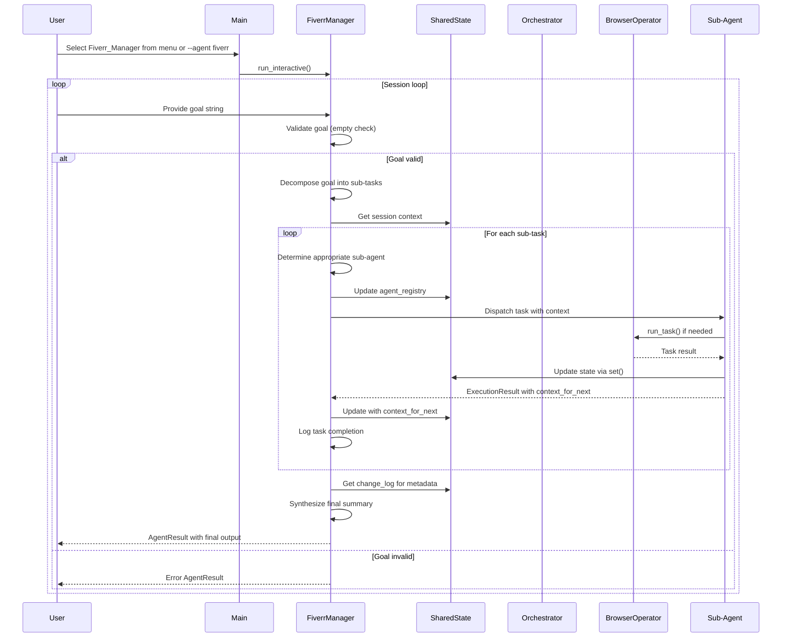

# Technical Design Document: Fiverr Automation Multi-Agent System

## Overview

The Fiverr Automation feature extends the UltraSwarm multi-agent system with a dedicated sub-swarm that fully automates the operation of a Fiverr freelance account. A Fiverr-specific orchestrator (the "Fiverr Manager") acts as the single point of access for all Fiverr operations, delegating work to five specialized sub-agents: Gig Creation, Web Scraping & Lead Generation, Account Management, Inbox & Communication, and Notification.

This design follows the requirements-first workflow established in `.kiro/specs/fiverr-automation/requirements.md`, which defines comprehensive acceptance criteria for each component.

### Feature Architecture Summary

```
┌─────────────────────────────────────────────────────────────────────────────────┐
│                              Fiverr_Manager (Orchestrator)                       │
│   ┌─────────────────────────────────────────────────────────────────────────┐   │
│   │  - Accepts high-level goals from user                                   │   │
│   │  - Decomposes goals into sub-tasks                                      │   │
│   │  - Maintains Shared_State for session context                           │   │
│   │  - Coordinates all Fiverr sub-agents                                    │   │
│   │  - Handles retries and error recovery                                   │   │
│   │  - Registers with UltraSwarm_Orchestrator                               │   │
│   └─────────────────────────────────────────────────────────────────────────┘   │
└─────────────────────────────────────────────────────────────────────────────────┘
                                    │
        ┌───────────────────────────┼───────────────────────────┐
        ▼                           ▼                           ▼
┌───────────────────┐   ┌───────────────────┐   ┌───────────────────┐
│ Gig_Creation_Agent│   │ Scraping_Lead_Gen │   │ Account_Management│
│                   │   │                   │   │                   │
│ - Marketplace     │   │ - Web scraping    │   │ - Performance     │
│   research        │   │ - Lead generation │   │   monitoring      │
│ - Gig drafting    │   │ - Data cleaning   │   │ - Deadline tracking│
│ - Browser pub-    │   │ - Output saving   │   │ - Health scoring  │
│   lishment        │   │                   │   │ - Recommendations │
└───────────────────┘   └───────────────────┘   └───────────────────┘
        ▼                           ▼                           ▼
┌───────────────────┐   ┌───────────────────┐
│ Inbox_Communicatio│   │ Notification_Agen│
│ n_Agent           │   │ t                │
│                   │   │                    │
│ - Inbox polling   │   │ - Email alerts   │
│ - Message classi- │   │ - Webhook alerts │
│   fication        │   │ - Event de-dup   │
│ - Auto-reply      │   │ - Multi-channel  │
│ - Manual mode     │   │   support        │
└───────────────────┘   └───────────────────┘
```

---

## Architecture

### System Layers

The Fiverr Automation feature is organized into four architectural layers:

```
┌─────────────────────────────────────────────────────────────────────────┐
│                         Entry Point Layer                               │
│  ┌──────────────────────┐  ┌──────────────────────┐                    │
│  │ main.py Interactive  │  │ main.py CLI (--agent)│                    │
│  │        Menu          │  │        CLI           │                    │
│  └───────────┬──────────┘  └───────────┬──────────┘                    │
└──────────────┼──────────────────────────┼──────────────────────────────┘
               │                          │
               └───────────┬──────────────┘
                           ▼
┌─────────────────────────────────────────────────────────────────────────┐
│                        Orchestrator Layer                               │
│  ┌───────────────────────────────────────────────────────────────────┐  │
│  │                    Fiverr_Manager (Orchestrator)                  │  │
│  │  - Goal decomposition                                             │  │
│  │  - Sub-agent routing                                              │  │
│  │  - State management (Shared_State)                                │  │
│  │  - Retry logic                                                    │  │
│  │  - Error handling                                                 │  │
│  │  - Audit logging                                                  │  │
│  └───────────────────────────────────────────────────────────────────┘  │
└─────────────────────────────────────────────────────────────────────────┘
                           │
         ┌─────────────────┼─────────────────┐
         ▼                 ▼                 ▼
┌──────────────────┐ ┌───────────────┐ ┌──────────────────┐
│   Worker Agents  │ │   Shared      │ │   Tool Layer     │
│                  │ │   State       │ │                  │
│ - Gig Creation   │ │ - In-memory   │ │ - BrowserOp      │
│ - Scraping       │ │ - JSONL log   �� │ - output_manager │
│ - Account        │ │ - Config      │ │ - browser        │
│ - Inbox          │ │ - Change log  │ │ - google_search  │
│ - Notification   │ │               │ │ - LLM client     │
└──────────────────┘ └───────────────┘ └──────────────────┘
```

### Component Interactions



### Data Flow

1. **Input Processing**: User provides a high-level goal string via interactive menu or CLI
2. **Goal Decomposition**: Fiverr_Manager decomposes the goal into ordered sub-tasks
3. **Context Assembly**: Shared_State provides session context to each sub-agent
4. **Task Delegation**: Sub-agents execute tasks, possibly using BrowserOperatorAgent for web automation
5. **State Updates**: Sub-agents update Shared_State with their results and context for next agent
6. **Retry Logic**: Fiverr_Manager retries failed non-critical tasks up to 2 additional times
7. **Output Synthesis**: Fiverr_Manager combines all results and creates natural-language summary
8. **Audit Logging**: Each task execution is logged to JSONL file with session ID
9. **Result Return**: Final AgentResult is returned to user with all required fields

---

## Components and Interfaces

### Directory Structure

```
agents/fiverr/
├── __init__.py              # Exports FiverrManager and ALL_FIVERR_AGENTS
├── shared/                  # Shared state and configuration
│   ├── __init__.py
│   ├── state.py            # Shared_State class
│   └── config.py           # Environment-based configuration
├── fiverr_manager_agent.py # Fiverr Manager orchestrator
├── gig_creation_agent.py   # Gig discovery and publishing
├── scraping_lead_gen_agent.py  # Web scraping and lead generation
├── account_management_agent.py # Performance monitoring
├── inbox_communication_agent.py # Inbox monitoring and replies
└── notification_agent.py   # Alert dispatching
```

### Agent Interface

All Fiverr agents conform to the BaseAgent-compatible interface:

```python
class BaseAgent:
    """Dynamically loads capabilities from JSON skills."""
    def __init__(self, skill_name: str, domain: str = "ecommerce"):
        self.skill_name = skill_name
        self.domain = domain
        self.skill: AgentSkill = load_skill(skill_name, domain)
        self.system_prompt = self.skill.system_prompt
        self.client = make_client(system_prompt=self.system_prompt, agent_name=self.skill.name)
    
    def execute_task(self, task: str, context: Optional[Dict[str, Any]] = None) -> ExecutionResult:
        """Executes a task and ensures output matches ExecutionResult schema."""
    
    def reset(self):
        """Reset the agent's memory/history."""
```

### Fiverr Agent Interface Extension

All Fiverr agents implement these additional methods:

```python
class FiverrAgent:
    """Base class for all Fiverr agents."""
    
    def get_metadata(self) -> dict:
        """Return agent metadata for registry and cross-agent awareness."""
        return {
            "name": self.name,
            "role": self.role,
            "description": self.description,
            "skills": [self.skill_id],
        }
    
    def run(self, input_data: dict) -> dict:
        """Execute agent with BaseAgent-compatible interface."""
    
    def run_interactive(self):
        """Interactive mode for standalone execution."""
```

### Shared State Interface

```python
class Shared_State:
    """Centralized state store for all Fiverr agents."""
    
    def __init__(self, session_id: str):
        self.session_id = session_id
        self.agent_registry = {}  # Agent metadata registry
        self.active_gigs = []  # List of active gig dictionaries
        self.open_orders = []  # List of open order dictionaries
        self.inbox_messages = []  # List of inbox message dictionaries
        self.new_events = []  # List of new event dictionaries
        self.notified_events = set()  # Set of notified event keys
        self.change_log = []  # List of state change dictionaries
    
    def get(self, key: str) -> Any:
        """Get value for key, return None if not exists."""
    
    def set(self, key: str, value: Any):
        """Set value and log to change_log."""
    
    def to_context_dict(self) -> dict:
        """Return dict representation for agent context."""
```

### Configuration Interface

```python
# agents/fiverr/shared/config.py
FIVERR_USERNAME: str  # From FIVERR_USERNAME env var
FIVERR_PASSWORD: str  # From FIVERR_PASSWORD env var
NOTIFICATION_EMAIL: str  # From NOTIFICATION_EMAIL env var
NOTIFICATION_WEBHOOK_URL: str  # From NOTIFICATION_WEBHOOK_URL env var
SMTP_HOST: str  # From SMTP_HOST env var
SMTP_PORT: str  # From SMTP_PORT env var (default: "25")
SMTP_USER: str  # From SMTP_USER env var
SMTP_PASSWORD: str  # From SMTP_PASSWORD env var
AUTO_REPLY: bool  # From AUTO_REPLY env var (case-insensitive "true")
```

---

## Data Models

### ExecutionResult Schema

```python
class ExecutionResult(BaseModel):
    """Standardized output for all agents across all domains."""
    status: str = Field(..., description="Status: 'success', 'error', 'partial'")
    data: Dict[str, Any] = Field(default_factory=dict, description="Payload data")
    message: str = Field(..., description="Human-readable summary")
    next_steps: Optional[str] = Field(None, description="Recommended next steps")
```

### AgentResult Schema

```python
class AgentResult(BaseModel):
    """Result structure for agent execution."""
    success: bool
    agent_name: str
    task_id: str
    output: Optional[Any]
    error: Optional[str]
    metadata: Dict[str, Any]
    context_for_next: Dict[str, Any] = Field(default_factory=dict)
    
    def to_dict(self) -> dict:
        """Convert to dictionary representation."""
```

### Session Log Entry (JSONL)

```python
{
    "timestamp": "2024-01-15T10:30:00Z",
    "agent_name": "GigCreationAgent",
    "task_description": "Publish gig for 'AI Chatbot Development'",
    "outcome": "success"  # or "error"
}
```

### State Change Log Entry

```python
{
    "key": "active_gigs",
    "value": [{"gig_id": "123", "title": "AI Chatbot Development"}],
    "timestamp": "2024-01-15T10:30:01Z"
}
```

### Event Dictionary

```python
{
    "event_type": "new_message",
    "message": "user123",
    "timestamp": "2024-01-15T10:30:00Z"
}
```

### Fiverr Manager Dispatch Context

```python
agent_input = {
    "task_id": "task_001",
    "instruction": "Publish a gig for AI services",
    "required_output": {"gig_title": str, "gig_id": str},
    "context": {
        "agent_registry": {...},  # Metadata from all Fiverr agents
        "shared_state": {...},  # Current state from Shared_State
        # ... other context fields
    },
    "skills_hint": ["gig_creation_skill"],
}
```

---

## Correctness Properties

*A property is a characteristic or behavior that should hold true across all valid executions of a system-essentially, a formal statement about what the system should do. Properties serve as the bridge between human-readable specifications and machine-verifiable correctness guarantees.*

### Property Reflection Summary

After analyzing all acceptance criteria, the following classifications were determined:

| Criteria | Classification | Reasoning |
|----------|---------------|-----------|
| 1.1-1.7, 2.1-2.6 | PROPERTY | Core orchestration logic that varies with input |
| 3.1-3.6 | PROPERTY | Gig creation logic with mocked external calls |
| 4.1-4.9 | PROPERTY | Scraping logic with data transformation |
| 5.1-5.9 | PROPERTY | Account management with metric calculations |
| 6.1-6.12 | PROPERTY | Inbox processing with state management |
| 7.1-7.11 | PROPERTY | Notification dispatch with channel selection |
| 8.1-8.7 | PROPERTY | Shared state operations |
| 9.1-9.4 | PROPERTY | Audit logging format |
| 10.1-10.5 | EXAMPLE | Specific UI/CLI behavior (not universally quantifiable) |

### Property 1: Goal Decomposition Produces Valid Sub-Tasks

*For any* non-empty goal string, the Fiverr_Manager SHALL decompose it into an ordered list of sub-tasks where each sub-task has a valid task_id, instruction, and required output structure.

**Validates: Requirements 1.1, 1.2**

### Property 2: Empty Goal Returns Error Response

*For any* input containing missing or empty goal field, the Fiverr_Manager SHALL return an AgentResult with status "error" and a descriptive error message.

**Validates: Requirements 1.2**

### Property 3: Sub-Agent Results Update Shared State

*For any* sub-agent that completes execution and returns context_for_next, the Fiverr_Manager SHALL update the Shared_State instance with the new context before invoking the next sub-agent.

**Validates: Requirements 1.3**

### Property 4: Critical Task Failures Halt Execution

*For any* sub-task marked with critical: True that returns status "error", the Fiverr_Manager SHALL immediately halt execution and return an error AgentResult without executing remaining sub-tasks.

**Validates: Requirements 1.6**

### Property 5: Non-Critical Task Retries Up to Two Times

*For any* sub-task marked with critical: False that returns status "error", the Fiverr_Manager SHALL retry the task up to two additional times before marking it as failed and continuing with remaining sub-tasks.

**Validates: Requirements 1.7**

### Property 6: Final Output Contains Synthesized Summary

*For any* complete execution of all sub-tasks, the Fiverr_Manager SHALL return an AgentResult with a message field containing a synthesized natural-language summary of 50-200 words in addition to raw sub-agent results in the data field.

**Validates: Requirements 1.11**

### Property 7: Agent Registry Contains All Sub-Agents

*For any* initialization of Fiverr_Manager, the agent_registry in Shared_State SHALL contain metadata for all five Fiverr sub-agents (Gig_Creation_Agent, Scraping_Lead_Gen_Agent, Account_Management_Agent, Inbox_Communication_Agent, Notification_Agent) keyed by agent name.

**Validates: Requirements 2.1**

### Property 8: Metadata Exceptions Halt Initialization

*For any* sub-agent whose get_metadata() method raises an exception during initialization, the Fiverr_Manager SHALL return an AgentResult with status "error" indicating which agent failed to register.

**Validates: Requirements 2.2**

### Property 9: Sub-Agent Dispatch Includes Agent Registry

*For any* task dispatched to a sub-agent, the Fiverr_Manager SHALL include the agent_registry dict from Shared_State in the context field of the sub-agent's input_data.

**Validates: Requirements 2.3**

### Property 10: Gig Creation Agent Output Contains Required Fields

*For any* successful gig creation execution, the Gig_Creation_Agent SHALL return a result containing context_for_next with non-empty gig_titles and gig_ids lists.

**Validates: Requirements 2.4, 3.6**

### Property 11: Scraping Agent Output Contains Record Count

*For any* scraping execution, the Scraping_Lead_Gen_Agent SHALL return a result containing context_for_next with record_count (int) and data_type (string).

**Validates: Requirements 2.5, 4.7**

### Property 12: Message Classification Covers All Categories

*For any* unread message in the inbox, the Inbox_Communication_Agent SHALL classify it into exactly one of the four categories: "price_inquiry", "order_details_request", "revision_request", or "general_inquiry".

**Validates: Requirements 6.4**

### Property 13: Reply Generation Respects Constraints

*For any* message that requires a reply, the Inbox_Communication_Agent SHALL generate a reply that is under 150 words and does not contain the phrases "as an AI", "I am an AI", "I'm an AI assistant", or "as a language model".

**Validates: Requirements 6.6**

### Property 14: Notification De-Duplication Prevents Repeated Alerts

*For any* notification dispatch, the Notification_Agent SHALL skip events whose event_type + timestamp composite key already appears in notified_events set.

**Validates: Requirements 7.11**

### Property 15: State Change Logging Captures All Updates

*For any* state update via Shared_State.set(), the change_log SHALL contain an entry with key, value, and timestamp fields.

**Validates: Requirements 8.3**

### Property 16: Audit Logging Records All Task Executions

*For any* task execution attempt (including retries), the Fiverr_Manager SHALL write a JSONL log entry to fiverr_session_{session_id}.log with timestamp, agent_name, task_description, and outcome fields.

**Validates: Requirements 9.1, 9.2**

---

## Error Handling

### Fiverr Manager Error Handling

```python
# Goal validation error
if not goal:
    return AgentResult(
        success=False,
        agent_name=self.name,
        task_id="root",
        output=None,
        error="No goal provided."
    ).to_dict()

# Sub-agent failure handling with retry
for attempt in range(1, max_retries + 1):
    result = self._execute_with_retry(agent, agent_input, max_retries)
    if result["success"]:
        return result
    # Log retry attempt
    console.print(f"[Fiverr_Manager] Retry {attempt}/{max_retries} for {agent.name}")
```

### Sub-Agent Error Handling

```python
def run(self, input_data: dict) -> dict:
    try:
        # Execute task logic
        result = self._execute_task()
        return {
            "success": True,
            "agent_name": self.name,
            "output": result,
            "context_for_next": self._build_context_for_next(result),
        }
    except Exception as e:
        # Log error and return error result
        self._log_error(e)
        return {
            "success": False,
            "agent_name": self.name,
            "error": str(e),
            "context_for_next": {},
        }
```

### Browser Automation Error Handling

```python
# BrowserOperatorAgent task failure
if not result.get("success"):
    return ExecutionResult(
        status="error",
        data={"gig_json": gig_data},  # Preserve data for manual publish
        message="Browser automation failed. Gig JSON preserved for manual publish."
    )
```

### Notification Channel Fallback

```python
# Email failure with webhook fallback
if not email_sent:
    logger.error("Email dispatch failed, attempting webhook fallback")
    if webhook_url:
        webhook_sent = self._send_webhook(event)
        if not webhook_sent:
            return {"dispatch_errors": ["email_failed", "webhook_failed"]}
        return {"success": True}
```

---

## Testing Strategy

### Dual Testing Approach

This feature requires both unit tests and property-based tests for comprehensive coverage:

- **Unit tests**: Verify specific examples, edge cases, and error conditions
- **Property tests**: Verify universal properties across all inputs (when applicable)
- **Integration tests**: Verify system integration points (not suitable for PBT)

### Property-Based Testing Configuration

**Testing Library**: `fast-check` (Python) or `pytest-quickcheck`

**Test Configuration**:
- Minimum 100 iterations per property test
- Tag format: `Feature: fiverr-automation, Property {number}: {property_text}`
- Mock external services (browser automation, SMTP, HTTP) for deterministic testing

### Test Categories by Acceptance Criterion

| Criterion | Test Type | Test Count | Notes |
|-----------|-----------|------------|-------|
| 1.1, 1.3, 1.7, 2.1-2.3, 2.4, 2.5, 3.1-3.4, 4.1-4.5, 4.7, 5.1-5.6, 5.8, 6.4, 6.5, 6.7, 6.9-6.11, 7.1-7.4, 7.6-7.8, 8.1-8.4, 8.6, 8.7, 9.1, 9.3, 9.4, 10.4, 10.5 | PROPERTY | ~30 | Run 100+ iterations each |
| 3.5, 4.6, 4.8, 5.7, 5.9, 6.2, 6.3, 6.8, 7.5, 7.9, 7.10 | EXAMPLE | ~15 | Run 1-3 iterations each |
| 1.4, 1.5, 1.6, 6.12, 7.11 | EDGE_CASE | ~7 | Include in property generators |
| 10.1, 10.2, 10.3 | SMOKE | 3 | Single execution, UI/CLI specific |

### Unit Test Examples

```python
# Test empty goal validation
def test_empty_goal_returns_error():
    manager = FiverrManager()
    result = manager.run({"goal": ""})
    assert result["status"] == "error"
    assert "missing" in result["message"].lower() or "empty" in result["message"].lower()

# Test agent registration
def test_agent_registry_contains_all_subagents():
    manager = FiverrManager()
    registry = manager.shared_state.agent_registry
    expected_agents = [
        "Gig_Creation_Agent",
        "Scraping_Lead_Gen_Agent", 
        "Account_Management_Agent",
        "Inbox_Communication_Agent",
        "Notification_Agent"
    ]
    for agent_name in expected_agents:
        assert agent_name in registry
        assert "description" in registry[agent_name]
```

### Property Test Examples

```python
# Property 1: Goal Decomposition
def test_goal_decomposition_produces_valid_subtasks():
    for goal in generate_random_goals():
        manager = FiverrManager()
        result = manager.run({"goal": goal})
        assert result["status"] == "success"
        assert len(result["data"]["sub_tasks"]) >= 1
        for task in result["data"]["sub_tasks"]:
            assert "task_id" in task
            assert "instruction" in task
            assert "required_output" in task

# Property 10: Gig Creation Output Format
def test_gig_creation_output_contains_required_fields():
    for gig in generate_random_gigs():
        agent = GigCreationAgent()
        result = agent.run(gig)
        context = result["context_for_next"]
        assert "gig_titles" in context
        assert "gig_ids" in context
        assert isinstance(context["gig_titles"], list)
        assert isinstance(context["gig_ids"], list)
        assert len(context["gig_titles"]) >= 1
        assert len(context["gig_ids"]) >= 1
```

### Integration Test Strategy

**Integration tests will verify**:
1. Fiverr_Manager integration with UltraSwarm_Orchestrator agent registry
2. Browser automation integration with Fiverr website (use mocks for PBT)
3. Email dispatch integration with SMTP server (use test mail server)
4. Webhook dispatch integration with webhook receivers (use test endpoint)

**Integration test count**: 5-10 representative examples per integration point

---

## Implementation Guidance

### Phase 1: Shared Infrastructure

1. Create `agents/fiverr/shared/__init__.py`
2. Implement `agents/fiverr/shared/state.py` with Shared_State class
3. Implement `agents/fiverr/shared/config.py` with environment-based configuration
4. Create `agents/fiverr/__init__.py` with exports

### Phase 2: Core Orchestrator

1. Create `agents/fiverr/fiverr_manager_agent.py`
2. Implement goal validation logic
3. Implement sub-task decomposition
4. Implement retry logic with configurable max retries
5. Implement state update coordination
6. Implement console logging with Rich formatting
7. Implement JSONL audit logging
8. Implement agent registration with UltraSwarm_Orchestrator

### Phase 3: Worker Agents

For each sub-agent (in order of dependency):

1. **Gig Creation Agent**
   - Implement marketplace research with google_search()
   - Implement gig generation with LLM
   - Implement browser automation for publishing
   - Implement error handling with data preservation

2. **Scraping Lead Generation Agent**
   - Implement URL extraction from category search
   - Implement page fetching with fetch_page()
   - Implement data cleaning (dedup, validation)
   - Implement retry logic for insufficient results

3. **Account Management Agent**
   - Implement dashboard navigation with browser
   - Implement metric extraction
   - Implement deadline checking logic
   - Implement health assessment scoring

4. **Inbox Communication Agent**
   - Implement message extraction
   - Implement message classification
   - Implement reply generation
   - Implement AUTO_REPLY toggle behavior

5. **Notification Agent**
   - Implement email dispatch with SMTP
   - Implement webhook dispatch with HTTP POST
   - Implement event de-duplication
   - Implement channel fallback logic

### Phase 4: Entry Point Integration

1. Update `main.py` interactive menu to include Fiverr section
2. Add CLI argument support for `--agent fiverr`
3. Implement run_interactive() method for FiverrManager
4. Test end-to-end workflow

### Key Implementation Notes

1. **Browser Automation**: Use existing `BrowserOperatorAgent` for Fiverr web tasks
2. **LLM Client**: Use `core.make_client()` for consistent LLM access
3. **Output Persistence**: Use `tools/output_manager.save_output()` for all outputs
4. **State Management**: Pass Shared_State instance to all sub-agents
5. **Logging**: Use Rich console logging with `[Fiverr_Manager]` prefix
6. **Error Recovery**: Preserve data in error cases for manual recovery
7. **Testing**: Start with unit tests, then add property tests for core logic

### File Naming Conventions

- Agent files: `{role}_agent.py` (e.g., `fiverr_manager_agent.py`, `gig_creation_agent.py`)
- Shared files: `shared/{file}.py` (e.g., `shared/state.py`)
- Module exports: `__init__.py` in each directory

### Configuration Dependencies

All Fiverr agents depend on these environment variables:

```bash
# Fiverr credentials
FIVERR_USERNAME=your_username
FIVERR_PASSWORD=your_password

# Notification settings
NOTIFICATION_EMAIL=your_email@example.com
NOTIFICATION_WEBHOOK_URL=https://example.com/webhook

# SMTP settings
SMTP_HOST=smtp.gmail.com
SMTP_PORT=587
SMTP_USER=your_smtp_user
SMTP_PASSWORD=your_smtp_password

# Auto-reply toggle (case-insensitive)
AUTO_REPLY=true
```

---

## Migration Notes

This feature extends the existing UltraSwarm architecture:

1. **BaseAgent Compatibility**: All Fiverr agents use `core.make_client()` and `ExecutionResult`
2. **Skill Integration**: Fiverr agents load skills from `tools/skill_loader.py`
3. **Output Management**: Use `tools/output_manager.save_output()` for persistence
4. **Browser Automation**: Reuse `agents/browser_operator_agent.py` for web tasks
5. **Agent Registry**: Register with `agents/managers/orchestrator_agent.py`

The feature does not require modifications to existing agents or core modules beyond the agent registry extension in `orchestrator_agent.py`.

---

## Verification Checklist

- [ ] All acceptance criteria from requirements.md are addressed in the design
- [ ] Shared_State class implements all required methods
- [ ] All six agents implement BaseAgent-compatible interface
- [ ] Agent registry includes all Fiverr agents
- [ ] Error handling preserves data for recovery
- [ ] Logging uses correct Rich formatting
- [ ] JSONL audit logging is implemented
- [ ] Property-based testing is planned for applicable criteria
- [ ] Entry point integration is specified
