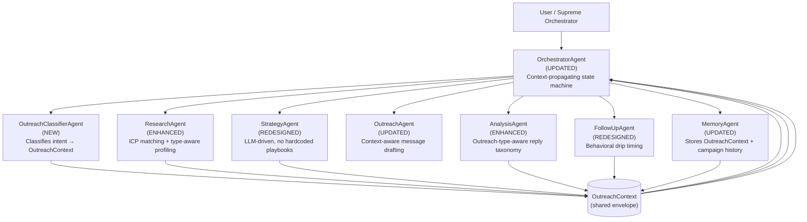
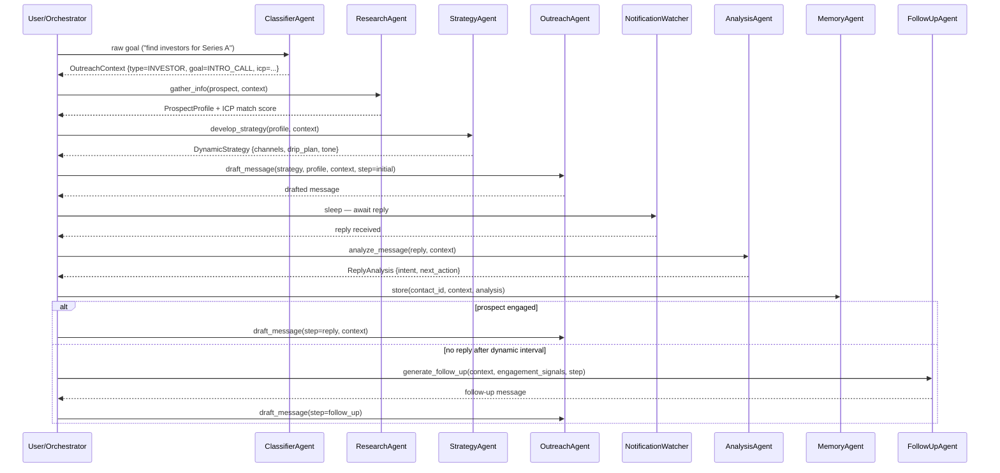
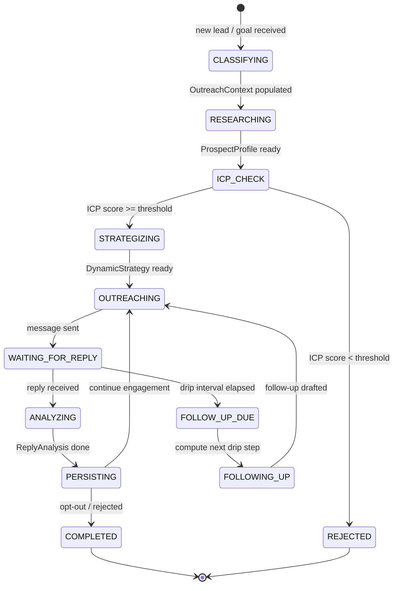

# Design Document: Outreach Agents Generalization

## Overview

The UltraSwarm outreach system currently handles a narrow slice of outreach scenarios — primarily cold lead generation with four hardcoded playbooks, fixed drip intervals, and no shared context for `outreach_type` across agents. This redesign generalizes the entire outreach swarm so it can autonomously handle any outreach mission: lead generation, B2B partnerships, investor relations, recruitment/hiring, event/webinar promotion, PR/media outreach, or any future type — without hardcoded logic in any single agent.

The core architectural shift is introducing an **OutreachContext** object as the shared runtime envelope that flows through every agent in the pipeline. This context carries the `outreach_type`, goal, ICP (Ideal Customer Profile) constraints, channel preferences, and behavioral signals. Every agent reads from and contributes to this context, enabling truly adaptive behavior driven by LLM reasoning rather than text-matching heuristics or static playbooks.

A new **OutreachClassifierAgent** sits at the entry point of the pipeline to interpret the user's intent and populate the initial OutreachContext before research even begins. The StrategyAgent is redesigned to generate strategies dynamically using LLM reasoning guided by the context, and the FollowUpAgent gains behavioral awareness — adjusting drip timing based on prospect engagement signals rather than fixed calendar intervals.


## Architecture

### High-Level Component Map



### Revised Pipeline Flow




## Components and Interfaces

### Component 1: OutreachContext (Shared Data Envelope)

**Purpose**: A typed, serializable context object that every agent reads from and writes to. It replaces the scattered per-agent string heuristics and is the single source of truth for "what kind of outreach is this."

**Interface**:
```python
@dataclass
class OutreachContext:
    # Classification
    outreach_type: str         # LEAD_GEN | PARTNERSHIP | INVESTOR | RECRUITMENT |
                               # EVENT_PROMO | PR_MEDIA | CUSTOMER_SUCCESS | GENERAL
    outreach_goal: str         # START_CONVERSATION | BOOK_INTRO_CALL | GET_REPLY |
                               # REQUEST_DEMO | COLLECT_INFO | SECURE_COMMITMENT
    campaign_mode: str         # SINGLE_PROSPECT | BULK_CAMPAIGN

    # ICP constraints (set by user or inferred by ClassifierAgent)
    icp: Dict[str, Any]        # {industries, seniority_levels, company_size_range,
                               #  geo, keywords, exclusions}

    # Channel preferences
    preferred_channels: List[str]   # ordered list, e.g. ["linkedin", "email", "whatsapp"]
    channel_fallback_policy: str    # SEQUENTIAL | PARALLEL | ESCALATE

    # Tone & messaging constraints
    sender_persona: str        # who we are presenting as (company, individual, etc.)
    value_proposition: str     # core value statement for this campaign
    compliance_flags: List[str]  # e.g. ["GDPR", "CAN-SPAM", "no_competitor_names"]

    # Runtime state (populated as pipeline runs)
    contact_id: str
    prospect_profile: Optional[str]
    strategy: Optional[Dict[str, Any]]
    engagement_signals: List[Dict[str, Any]]   # list of {timestamp, event, platform}
    current_drip_step: int
    opted_out: bool
```

**Responsibilities**:
- Carries all context needed by every downstream agent
- Serializable to/from JSON (stored in MemoryAgent)
- Immutable classification fields; mutable runtime state fields

---

### Component 2: OutreachClassifierAgent (NEW)

**Purpose**: Interprets the user's raw outreach goal into a structured OutreachContext. This is the entry point that eliminates all hardcoded assumptions from downstream agents.

**Interface**:
```python
class OutreachClassifierAgent:
    def classify(self, raw_goal: str, hints: Dict[str, Any] = {}) -> OutreachContext
    def run(self, input_data: dict) -> dict   # Supreme Orchestrator compatible
    def get_metadata(self) -> dict
```

**Responsibilities**:
- Accept a free-text goal (e.g. "find angel investors for our pre-seed round")
- LLM-classify into `outreach_type`, `outreach_goal`, and `campaign_mode`
- Derive initial ICP constraints from the goal text
- Populate `preferred_channels` based on outreach type defaults
- Fall back to rule-based classification when LLM is unavailable
- Return a fully populated `OutreachContext` ready to seed the pipeline

**Outreach Type Taxonomy**:

| outreach_type | Typical Goal | Default Primary Channel |
|---|---|---|
| `LEAD_GEN` | Book a meeting / Get a reply | LinkedIn or Email |
| `PARTNERSHIP` | Intro call / Explore collaboration | LinkedIn → Email |
| `INVESTOR` | Secure intro / Send deck | Email → LinkedIn |
| `RECRUITMENT` | Get application / Intro call | LinkedIn → Email |
| `EVENT_PROMO` | RSVP / Registration | Email → Social |
| `PR_MEDIA` | Coverage / Feature / Interview | Email |
| `CUSTOMER_SUCCESS` | Upsell / Renewal / NPS | Email → WhatsApp |
| `GENERAL` | Any of the above | Email |

---

### Component 3: ResearchAgent (ENHANCED)

**Purpose**: Existing agent gains ICP matching awareness and type-specific research angles. Research depth and focus shifts based on `outreach_type`.

**Interface additions**:
```python
class ResearchAgent:
    # Existing methods preserved
    def gather_info(self, target_name: str, target_company: str,
                    target_industry: str = "",
                    context: OutreachContext = None) -> ProspectProfile

    def score_icp_match(self, profile: str, icp: Dict[str, Any]) -> ICPMatchResult
```

**New: ICPMatchResult**:
```python
@dataclass
class ICPMatchResult:
    score: float           # 0.0 – 1.0
    matched_criteria: List[str]
    failed_criteria: List[str]
    recommendation: str    # APPROVE | DEPRIORITIZE | REJECT
```

**Responsibilities**:
- Apply type-specific research focus:
  - `INVESTOR`: portfolio companies, fund stage, investment thesis
  - `RECRUITMENT`: current role tenure, career trajectory, open roles at their company
  - `PARTNERSHIP`: tech stack, integration ecosystem, shared customer segments
  - `EVENT_PROMO`: past event attendance, community activity
- Score prospect against ICP before passing to StrategyAgent
- Reject or deprioritize contacts that fail ICP scoring below threshold


---

### Component 4: StrategyAgent (REDESIGNED)

**Purpose**: Replaced hardcoded 4-playbook system with an LLM-driven strategy generator that uses OutreachContext as its primary input. Zero hardcoded playbooks remain.

**Interface**:
```python
class StrategyAgent:
    def develop_strategy(self, prospect_profile: str,
                         context: OutreachContext) -> DynamicStrategy
```

**New: DynamicStrategy**:
```python
@dataclass
class DynamicStrategy:
    target_contact_status: str          # APPROVED | REJECTED
    rejection_reason: Optional[str]

    # Channel plan
    channel_sequence: List[ChannelStep]  # ordered list with conditions

    # Messaging
    persona_classification: str          # inferred from profile + context
    hook_strategy: str                   # specific personalization angle
    value_frame: str                     # how to frame value for this outreach_type
    tone_directives: str

    # Drip plan — dynamic intervals based on outreach_type and goal
    drip_plan: List[DripStep]

    # Campaign goal (copied from context, can be refined)
    campaign_goal: str
```

**New: ChannelStep**:
```python
@dataclass
class ChannelStep:
    channel: str             # email | linkedin | whatsapp | sms | ...
    order: int               # 1 = primary, 2 = secondary fallback, etc.
    trigger_condition: str   # "always" | "no_reply_after_N_days" | "bounce"
    wait_days: int           # days before attempting this channel
```

**New: DripStep**:
```python
@dataclass
class DripStep:
    step_number: int
    days_after_previous: int     # dynamic — not hardcoded
    message_theme: str           # e.g. "social_proof" | "resource_share" | "breakup"
    trigger_condition: str       # "no_reply" | "low_engagement" | "high_engagement"
    channel: str
```

**Responsibilities**:
- No hardcoded playbooks — all strategy is LLM-generated from `OutreachContext` + `ProspectProfile`
- Produce multi-touch `channel_sequence` (e.g. LinkedIn first → Email day 3 → WhatsApp day 7)
- Drip intervals are dynamic: `INVESTOR` type uses longer, more patient intervals (day 7, 14, 21); `EVENT_PROMO` uses compressed intervals (day 1, 3, 6 before the event date)
- Rule-based fallback generates reasonable defaults per `outreach_type` without LLM

---

### Component 5: OutreachAgent (UPDATED)

**Purpose**: Existing platform-routing logic preserved. Gains OutreachContext awareness to tune message framing by outreach type.

**Interface additions**:
```python
class OutreachAgent:
    def draft_message(self, strategy: DynamicStrategy,
                      prospect_profile: str,
                      context: OutreachContext,
                      memory: str = "",
                      step: str = "initial") -> str
```

**Responsibilities**:
- Pass `outreach_type` and `outreach_goal` into all LLM prompts to steer framing:
  - `INVESTOR`: credibility-first, traction metrics, warm and peer-level tone
  - `RECRUITMENT`: candidate-centric, growth opportunity framing, no pressure
  - `PARTNERSHIP`: mutual benefit framing, shared audience/tech alignment
  - `EVENT_PROMO`: urgency + exclusivity, clear RSVP CTA
- All existing platform routing (Email → EmailDraftingAgent, Social → SocialMediaAgent, etc.) is preserved unchanged
- Message length and formality driven by `tone_directives` from DynamicStrategy

---

### Component 6: AnalysisAgent (ENHANCED)

**Purpose**: Existing taxonomy preserved. Gains outreach-type-aware interpretation so "interested" signals are calibrated correctly per mission type.

**Interface additions**:
```python
class AnalysisAgent:
    def analyze_message(self, message: str,
                        context: OutreachContext = None) -> ReplyAnalysis
```

**New taxonomy additions**:
- `Outreach_Type_Specific_Signals`: type-specific positive/negative indicators (e.g. for `INVESTOR`: "send deck" = High; for `RECRUITMENT`: "open to opportunities" = High)
- `Campaign_Stage_Recommendation`: `ADVANCE` | `PAUSE` | `ESCALATE_TO_HUMAN` | `STOP`

---

### Component 7: FollowUpAgent (REDESIGNED)

**Purpose**: Fixed Day 1/3/7/14/30 intervals replaced with behavioral, context-driven drip scheduling.

**Interface**:
```python
class FollowUpAgent:
    def generate_follow_up(self, prospect_profile: str,
                           memory_summary: str,
                           context: OutreachContext,
                           drip_step: DripStep) -> str

    def compute_next_drip_step(self, context: OutreachContext,
                               engagement_signals: List[Dict]) -> DripStep
```

**Responsibilities**:
- `compute_next_drip_step` evaluates `engagement_signals` (email opens, link clicks, reply latency) to adjust timing dynamically
- Drip message themes are driven by `drip_plan` in `DynamicStrategy`, not static templates
- Per-type default drip profiles used as fallback:

| outreach_type | Default Drip Cadence |
|---|---|
| `LEAD_GEN` | Day 3 → Day 7 → Day 14 → Day 30 |
| `INVESTOR` | Day 7 → Day 14 → Day 21 → Day 45 |
| `RECRUITMENT` | Day 4 → Day 10 → Day 20 |
| `PARTNERSHIP` | Day 5 → Day 12 → Day 25 |
| `EVENT_PROMO` | Day 2 → Day 5 → Day 1-before-event |
| `PR_MEDIA` | Day 3 → Day 7 → Day 14 |

- Engagement acceleration: if prospect opens email but doesn't reply, compress next interval by 30%
- Message themes pulled from `drip_step.message_theme` rather than step number alone


---

### Component 8: OrchestratorAgent (UPDATED)

**Purpose**: Existing state machine logic preserved. Gains OutreachContext threading — context is loaded at pipeline start and passed through every agent handoff.

**State machine (unchanged transitions, new context propagation)**:



**New context threading pattern**:
- `OutreachContext` is stored in `SwarmState.metadata["outreach_context"]`
- Every agent call receives the current context and returns an updated copy
- `MemoryAgent` persists the full context to disk at each state transition

---

## Data Models

### OutreachContext (full schema)

```python
@dataclass
class OutreachContext:
    # --- Classification (set by ClassifierAgent, immutable) ---
    outreach_type: str          # LEAD_GEN | PARTNERSHIP | INVESTOR | RECRUITMENT |
                                #   EVENT_PROMO | PR_MEDIA | CUSTOMER_SUCCESS | GENERAL
    outreach_goal: str          # START_CONVERSATION | BOOK_INTRO_CALL | GET_REPLY |
                                #   REQUEST_DEMO | COLLECT_INFO | SECURE_COMMITMENT
    campaign_mode: str          # SINGLE_PROSPECT | BULK_CAMPAIGN
    campaign_id: str            # unique ID for this campaign run

    # --- ICP (set by ClassifierAgent, refined by ResearchAgent) ---
    icp: Dict[str, Any]         # {industries, seniority_levels, company_size_range,
                                #   geo, keywords, exclusions, min_icp_score}

    # --- Channel preferences (set by ClassifierAgent + StrategyAgent) ---
    preferred_channels: List[str]
    channel_fallback_policy: str     # SEQUENTIAL | PARALLEL | ESCALATE

    # --- Messaging (set by StrategyAgent) ---
    sender_persona: str
    value_proposition: str
    compliance_flags: List[str]

    # --- Runtime state (mutated as pipeline progresses) ---
    contact_id: str
    prospect_profile: Optional[str]
    icp_match: Optional[ICPMatchResult]
    strategy: Optional[DynamicStrategy]
    engagement_signals: List[Dict[str, Any]]
    current_drip_step: int
    opted_out: bool
    campaign_stage: str              # CLASSIFYING | RESEARCHING | STRATEGIZING |
                                     #   OUTREACHING | WAITING | ANALYZING | COMPLETED
```

### ICPMatchResult

```python
@dataclass
class ICPMatchResult:
    score: float                 # 0.0 – 1.0
    matched_criteria: List[str]
    failed_criteria: List[str]
    recommendation: str          # APPROVE | DEPRIORITIZE | REJECT
    confidence: float
```

### DynamicStrategy

```python
@dataclass
class DynamicStrategy:
    target_contact_status: str
    rejection_reason: Optional[str]
    channel_sequence: List[ChannelStep]
    persona_classification: str
    hook_strategy: str
    value_frame: str
    tone_directives: str
    drip_plan: List[DripStep]
    campaign_goal: str
    generated_by: str            # "llm" | "rule_fallback"
```

### ChannelStep

```python
@dataclass
class ChannelStep:
    channel: str
    order: int
    trigger_condition: str       # "always" | "no_reply_after_{N}_days" | "bounce"
    wait_days: int
    message_hint: str            # optional tone/content hint for this channel
```

### DripStep

```python
@dataclass
class DripStep:
    step_number: int
    days_after_previous: int
    message_theme: str           # social_proof | resource_share | direct_ask |
                                 #   breakup | urgency | milestone_reference
    trigger_condition: str       # no_reply | low_engagement | high_engagement | always
    channel: str
    accelerate_on_open: bool     # compress interval if open/click detected
```


## Correctness Properties

The following invariants must hold across all system states. Each is expressed as a testable property using the `hypothesis` library.

### Property 1: OutreachContext Classification Completeness

**Validates: Requirements 1.1, 1.2, 1.3, 1.4**

For any raw goal string, `ClassifierAgent.classify()` always returns an `OutreachContext` with non-empty `outreach_type`, `outreach_goal`, and `campaign_mode` drawn from the valid taxonomy sets, and a non-empty `preferred_channels` list.

```python
from hypothesis import given, strategies as st

VALID_OUTREACH_TYPES = {
    "LEAD_GEN", "PARTNERSHIP", "INVESTOR", "RECRUITMENT",
    "EVENT_PROMO", "PR_MEDIA", "CUSTOMER_SUCCESS", "GENERAL"
}
VALID_OUTREACH_GOALS = {
    "START_CONVERSATION", "BOOK_INTRO_CALL", "GET_REPLY",
    "REQUEST_DEMO", "COLLECT_INFO", "SECURE_COMMITMENT"
}
VALID_CAMPAIGN_MODES = {"SINGLE_PROSPECT", "BULK_CAMPAIGN"}

@given(raw_goal=st.text(min_size=1, max_size=500))
def test_classifier_always_returns_valid_taxonomy(raw_goal, classifier_agent):
    ctx = classifier_agent.classify(raw_goal)
    assert ctx.outreach_type in VALID_OUTREACH_TYPES
    assert ctx.outreach_goal in VALID_OUTREACH_GOALS
    assert ctx.campaign_mode in VALID_CAMPAIGN_MODES
    assert ctx.preferred_channels  # never empty list
```

### Property 2: StrategyAgent Never Returns an Empty Channel Sequence

**Validates: Requirements 2.1, 2.2, 2.3**

For any valid `OutreachContext` (any `outreach_type`, any `outreach_goal`), `StrategyAgent.develop_strategy()` always returns a `DynamicStrategy` with at least one `ChannelStep` and at least one `DripStep`, and `target_contact_status` is always `APPROVED` or `REJECTED`.

```python
from hypothesis import given, strategies as st
from hypothesis.strategies import composite

@composite
def outreach_contexts(draw):
    return OutreachContext(
        outreach_type=draw(st.sampled_from(list(VALID_OUTREACH_TYPES))),
        outreach_goal=draw(st.sampled_from(list(VALID_OUTREACH_GOALS))),
        campaign_mode=draw(st.sampled_from(list(VALID_CAMPAIGN_MODES))),
        campaign_id=draw(st.uuids()).hex,
        icp={"min_icp_score": draw(st.floats(min_value=0.0, max_value=1.0))},
        preferred_channels=draw(st.lists(
            st.sampled_from(["email", "linkedin", "whatsapp"]), min_size=1
        )),
        channel_fallback_policy="SEQUENTIAL",
        sender_persona=draw(st.text(min_size=1, max_size=100)),
        value_proposition=draw(st.text(min_size=1, max_size=200)),
        compliance_flags=[],
        contact_id=draw(st.uuids()).hex,
        prospect_profile=None,
        icp_match=None,
        strategy=None,
        engagement_signals=[],
        current_drip_step=0,
        opted_out=False,
        campaign_stage="STRATEGIZING",
    )

@given(ctx=outreach_contexts(), prospect_profile=st.text(min_size=1, max_size=1000))
def test_strategy_always_has_channel_and_drip(ctx, prospect_profile, strategy_agent):
    strategy = strategy_agent.develop_strategy(prospect_profile, ctx)
    assert len(strategy.channel_sequence) >= 1, "channel_sequence must never be empty"
    assert len(strategy.drip_plan) >= 1, "drip_plan must never be empty"
    assert strategy.target_contact_status in {"APPROVED", "REJECTED"}
```

### Property 3: ICP Score Monotonicity — Matched Criteria Bound Score

**Validates: Requirements 3.1, 3.2, 3.3**

For any `ICPMatchResult`, the score must be non-negative and at most 1.0. When `score >= 1.0`, `matched_criteria` must be non-empty. When `score == 0.0`, `failed_criteria` must be non-empty (something must have failed).

```python
@given(
    score=st.floats(min_value=0.0, max_value=1.0, allow_nan=False),
    matched=st.lists(st.text(min_size=1), min_size=0, max_size=10),
    failed=st.lists(st.text(min_size=1), min_size=0, max_size=10),
)
def test_icp_score_criteria_consistency(score, matched, failed, research_agent):
    result = ICPMatchResult(
        score=score,
        matched_criteria=matched,
        failed_criteria=failed,
        recommendation="APPROVE" if score >= 0.3 else "REJECT",
        confidence=score,
    )
    if score >= 1.0:
        assert len(result.matched_criteria) >= 1
    if score == 0.0:
        assert len(result.failed_criteria) >= 1
    assert 0.0 <= result.score <= 1.0
```

### Property 4: Drip Intervals Are Always Positive

**Validates: Requirements 4.1, 4.2**

For any `OutreachContext` and any list of engagement signals (including empty), `FollowUpAgent.compute_next_drip_step()` always returns a `DripStep` with `days_after_previous > 0`. Drip timing can never be zero or negative.

```python
@composite
def engagement_signal_lists(draw):
    signal = st.fixed_dictionaries({
        "timestamp": st.floats(min_value=0),
        "event": st.sampled_from(["open", "click", "reply", "bounce"]),
        "platform": st.sampled_from(["email", "linkedin", "whatsapp"]),
    })
    return draw(st.lists(signal, min_size=0, max_size=20))

@given(ctx=outreach_contexts(), signals=engagement_signal_lists())
def test_drip_interval_always_positive(ctx, signals, follow_up_agent):
    drip_step = follow_up_agent.compute_next_drip_step(ctx, signals)
    assert drip_step.days_after_previous > 0, (
        f"drip interval must be positive, got {drip_step.days_after_previous}"
    )
    assert drip_step.step_number >= 1
    assert drip_step.channel  # non-empty channel
```

### Property 5: Opted-Out Contacts Never Produce Drafted Messages

**Validates: Requirements 5.1, 5.2, 5.3**

For any `OutreachContext` where `opted_out = True`, all message drafting calls return an empty string or a sentinel non-delivery value — never a real message body. This invariant must hold regardless of `outreach_type`, `strategy`, or `drip_step`.

```python
@given(
    ctx=outreach_contexts().map(lambda c: dataclasses.replace(c, opted_out=True)),
    step=st.sampled_from(["initial", "follow_up", "reply"]),
)
def test_opted_out_never_drafts_message(ctx, step, outreach_agent, strategy_agent):
    strategy = DynamicStrategy(
        target_contact_status="APPROVED",
        rejection_reason=None,
        channel_sequence=[ChannelStep("email", 1, "always", 0, "")],
        persona_classification="professional",
        hook_strategy="direct",
        value_frame="mutual benefit",
        tone_directives="formal",
        drip_plan=[DripStep(1, 3, "social_proof", "no_reply", "email", False)],
        campaign_goal=ctx.outreach_goal,
        generated_by="rule_fallback",
    )
    message = outreach_agent.draft_message(strategy, "profile text", ctx, step=step)
    assert not message or message.strip() == "", (
        "opted-out contact must never receive a drafted message"
    )
```

### Property 6: OutreachContext Round-Trip Serialization Preserves All Fields

**Validates: Requirements 6.1, 6.2**

For any `OutreachContext`, serializing to JSON and deserializing back produces an object equal to the original. No field is silently dropped or coerced to a different type.

```python
import json
import dataclasses

@given(ctx=outreach_contexts())
def test_context_json_roundtrip(ctx):
    serialized = json.dumps(dataclasses.asdict(ctx))
    restored = OutreachContext(**json.loads(serialized))
    assert restored.outreach_type == ctx.outreach_type
    assert restored.outreach_goal == ctx.outreach_goal
    assert restored.campaign_mode == ctx.campaign_mode
    assert restored.opted_out == ctx.opted_out
    assert restored.current_drip_step == ctx.current_drip_step
    assert restored.engagement_signals == ctx.engagement_signals
    assert restored.compliance_flags == ctx.compliance_flags
```

### Property 7: ICP Rejection Blocks Strategy Generation

**Validates: Requirements 3.4, 3.5**

For any prospect that receives an `ICPMatchResult` with `recommendation = "REJECT"`, the resulting `DynamicStrategy.target_contact_status` must be `"REJECTED"` — the strategy pipeline must not proceed to drafting for a rejected prospect.

```python
@given(
    ctx=outreach_contexts(),
    prospect_profile=st.text(min_size=1, max_size=1000),
    failed_criteria=st.lists(st.text(min_size=1), min_size=1, max_size=5),
)
def test_icp_reject_propagates_to_strategy(
    ctx, prospect_profile, failed_criteria, strategy_agent
):
    rejected_match = ICPMatchResult(
        score=0.0,
        matched_criteria=[],
        failed_criteria=failed_criteria,
        recommendation="REJECT",
        confidence=0.95,
    )
    ctx_with_reject = dataclasses.replace(ctx, icp_match=rejected_match)
    strategy = strategy_agent.develop_strategy(prospect_profile, ctx_with_reject)
    assert strategy.target_contact_status == "REJECTED"
    assert strategy.rejection_reason is not None and strategy.rejection_reason.strip()
```

### Property 8: AnalysisAgent Campaign_Stage_Recommendation Is Always Valid

**Validates: Requirements 10.1**

For any reply message and any OutreachContext, `AnalysisAgent.analyze_message()` always returns a `Campaign_Stage_Recommendation` that is one of the four valid values: ADVANCE, PAUSE, ESCALATE_TO_HUMAN, STOP.

```python
VALID_STAGE_RECOMMENDATIONS = {"ADVANCE", "PAUSE", "ESCALATE_TO_HUMAN", "STOP"}

@given(
    reply=st.text(min_size=1, max_size=2000),
    ctx=outreach_contexts(),
)
def test_analysis_recommendation_always_valid(reply, ctx, analysis_agent):
    result = analysis_agent.analyze_message(reply, ctx)
    assert result.campaign_stage_recommendation in VALID_STAGE_RECOMMENDATIONS
```

### Property 9: Compliance Flags Are Enforced in All Email Drafts

**Validates: Requirements 11.1, 11.2**

For any OutreachContext with "GDPR" in `compliance_flags`, every email message drafted by OutreachAgent must contain an unsubscribe mechanism. For any OutreachContext with "CAN-SPAM" in `compliance_flags`, every email message must contain a physical address.

```python
@given(
    ctx=outreach_contexts().map(lambda c: dataclasses.replace(
        c, compliance_flags=["GDPR", "CAN-SPAM"]
    )),
    prospect_profile=st.text(min_size=1, max_size=1000),
)
def test_compliance_flags_enforced_in_email(ctx, prospect_profile, outreach_agent):
    strategy = _make_email_strategy(ctx)
    message = outreach_agent.draft_message(strategy, prospect_profile, ctx, step="initial")
    if "GDPR" in ctx.compliance_flags:
        assert "unsubscribe" in message.lower(), "GDPR requires unsubscribe link"
    if "CAN-SPAM" in ctx.compliance_flags:
        assert any(
            keyword in message.lower()
            for keyword in ["address", "suite", "street", "ave", "rd"]
        ), "CAN-SPAM requires physical address"
```

---

## Error Handling

### Error Scenario 1: LLM Classification Failure (ClassifierAgent)

**Condition**: LLM unavailable or returns malformed JSON when classifying raw goal.
**Response**: Rule-based keyword matching against `outreach_type` taxonomy. Keywords like "investor", "fund", "raise" → `INVESTOR`; "hire", "candidate", "role" → `RECRUITMENT`; etc.
**Recovery**: Pipeline continues with `outreach_type = "GENERAL"` as ultimate fallback — downstream agents produce valid (if generic) output.

### Error Scenario 2: ICP Score Below Threshold

**Condition**: `ICPMatchResult.score < icp["min_icp_score"]` (default 0.3).
**Response**: OrchestratorAgent transitions to `REJECTED` state. Contact is logged as deprioritized with score and criteria.
**Recovery**: If `campaign_mode = BULK_CAMPAIGN`, the orchestrator skips this contact and advances to the next in the list without halting the campaign.

### Error Scenario 3: StrategyAgent Returns No Valid Channel

**Condition**: LLM strategy generation produces a `channel_sequence` that doesn't match any available platform in OutreachAgent.
**Response**: StrategyAgent rule fallback selects default channels based on `outreach_type` (e.g. `INVESTOR` → `["email", "linkedin"]`).
**Recovery**: OutreachAgent falls back to `_draft_llm_direct` with platform = "email".

### Error Scenario 4: No Engagement Signal Data for Drip Timing

**Condition**: `engagement_signals` list is empty when FollowUpAgent calls `compute_next_drip_step`.
**Response**: Use the per-`outreach_type` default drip cadence table (static defaults).
**Recovery**: Drip proceeds on schedule. If signals become available later, subsequent steps use behavioral timing.

### Error Scenario 5: OutreachContext Deserialization Failure (MemoryAgent)

**Condition**: Stored `OutreachContext` JSON is corrupted or missing required fields.
**Response**: MemoryAgent logs the error and reconstructs a minimal context from available fields (`contact_id`, `outreach_type` if present).
**Recovery**: OrchestratorAgent triggers ClassifierAgent again for the contact to re-populate context from memory summary.

## Testing Strategy

### Unit Testing Approach

Each agent should have isolated unit tests covering:
- `OutreachClassifierAgent.classify()` — test all 8 `outreach_type` values with representative free-text inputs and verify correct field population
- `ResearchAgent.score_icp_match()` — test score boundaries (0.0, 0.3 threshold, 1.0), matched vs. failed criteria lists
- `StrategyAgent.develop_strategy()` with rule-based fallback — verify non-empty `channel_sequence` and `drip_plan` for each `outreach_type`
- `FollowUpAgent.compute_next_drip_step()` — verify interval compression when `accelerate_on_open=True` and engagement signal present
- `OutreachContext` serialization/deserialization round-trip (no data loss)

### Property-Based Testing Approach

**Property Test Library**: `hypothesis` (already a Python project)

Key properties to verify:
- For any valid `OutreachContext`, `StrategyAgent.develop_strategy()` always returns a `DynamicStrategy` with at least one `ChannelStep` — never empty `channel_sequence`
- For any `ICPMatchResult` with `score >= 1.0`, `matched_criteria` is non-empty
- `FollowUpAgent.compute_next_drip_step()` always returns a `DripStep` with `days_after_previous > 0` — drip intervals never go backwards or to zero
- `OutreachContext` with `opted_out = True` never produces a drafted message — all drafting agents return early when `opted_out` flag is set

### Integration Testing Approach

- End-to-end pipeline test: raw goal string → ClassifierAgent → ResearchAgent (mocked profile) → StrategyAgent → OutreachAgent → verify drafted message contains context-appropriate framing per `outreach_type`
- Multi-channel sequence test: verify OrchestratorAgent correctly follows `channel_sequence` order and only advances to next channel when trigger condition is met
- Bulk campaign mode test: 10 mock prospects with mixed ICP scores — verify rejected contacts are skipped without halting the loop

## Performance Considerations

- `OutreachContext` serialization to JSON should exclude `prospect_profile` (large string) from the inline object — store it as a separate file reference in MemoryAgent to keep the context object lightweight
- `OutreachClassifierAgent` should cache classification results by `campaign_id` — re-classifying the same goal for bulk campaigns is wasteful
- `ResearchAgent` ICP scoring can run in parallel with the main profile synthesis since it operates on the same data — use `concurrent.futures.ThreadPoolExecutor` where the base pattern already supports it
- LLM calls in `StrategyAgent` use the full `OutreachContext` — trim `prospect_profile` to 1000 chars max in the prompt to stay within reasonable token budgets

## Security Considerations

- `compliance_flags` in `OutreachContext` must be checked before message delivery in `OutreachAgent` — if `"GDPR"` is set, email messages must include unsubscribe links; if `"CAN-SPAM"` is set, physical address must be included
- `opted_out = True` contacts must never receive messages — this check happens in OrchestratorAgent before any agent call, not inside individual agents, to prevent any bypass
- ICP exclusion lists (competitor companies, opted-out domains) are checked in ClassifierAgent and ResearchAgent before research resources are spent on a contact
- Memory files in `agent_workspace/outreach_memory/` store full `OutreachContext` including any PII (prospect names, contact info) — these files should not be committed to version control (already covered by `.gitignore`)

## Dependencies

**No new external dependencies required.** All components build on existing infrastructure:

- `core.make_client` — LLM client factory (existing)
- `agents/external/email_drafting_agent.py` — EmailDraftingAgent (existing, unchanged)
- `agents/external/social_media_agent.py` — SocialMediaAgent (existing, unchanged)
- `agents/external/web_research_agent.py` — WebResearchAgent (existing, unchanged)
- `agents/external/competitive_analysis_agent.py` — CompetitiveAnalysisAgent (existing, unchanged)
- `agents/browser_operator_agent.py` — BrowserOperatorAgent (existing, unchanged)
- `dataclasses` — stdlib, used for OutreachContext and related models
- `hypothesis` — property-based testing (install if not already present: `pip install hypothesis`)

**New files to create**:
- `agents/outreach/classifier_agent.py` — OutreachClassifierAgent
- `agents/outreach/context.py` — OutreachContext, ICPMatchResult, DynamicStrategy, ChannelStep, DripStep dataclasses

**Files to modify**:
- `agents/outreach/orchestrator_agent.py` — add context threading, new `CLASSIFYING` and `ICP_CHECK` states
- `agents/outreach/research_agent.py` — add `score_icp_match()`, context-aware research focus
- `agents/outreach/strategy_agent.py` — replace `_rule_based_strategy()` with type-aware fallback, accept `OutreachContext`, return `DynamicStrategy`
- `agents/outreach/outreach_agent.py` — pass `outreach_type` into LLM prompts, accept `OutreachContext`
- `agents/outreach/analysis_agent.py` — add type-specific signal taxonomy, `Campaign_Stage_Recommendation`
- `agents/outreach/follow_up_agent.py` — add `compute_next_drip_step()`, behavioral interval logic, replace static drip templates with theme-driven generation
- `agents/outreach/memory_agent.py` — store/retrieve `OutreachContext` alongside existing history
- `agents/outreach/__init__.py` — export new agents and context types
