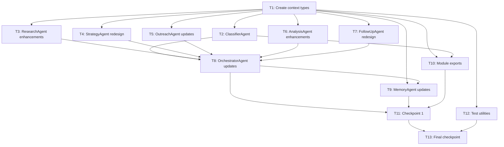

# Implementation Plan: Outreach Agents Generalization

## Overview

This plan generalizes the UltraSwarm outreach swarm to handle any outreach mission (lead generation, partnerships, investor relations, recruitment, event promotion, PR/media, customer success) without hardcoded playbooks. The core architectural change introduces an **OutreachContext** shared envelope that flows through every agent, a new **OutreachClassifierAgent** at the entry point, and behavioral drip timing driven by engagement signals.

## Tasks

- [ ] 1. Create shared context types and dataclasses
  - Create `agents/outreach/context.py` with OutreachContext, ICPMatchResult, DynamicStrategy, ChannelStep, and DripStep dataclasses
  - Include JSON serialization/deserialization methods for all types
  - Add type validation and default values per design spec
  - _Requirements: 1.1, 1.2, 1.3, 1.4, 6.1, 6.2_

- [ ]* 1.1 Write property tests for OutreachContext round-trip serialization
  - **Property 6: OutreachContext Round-Trip Serialization Preserves All Fields**
  - **Validates: Requirements 6.1, 6.2**

- [ ] 2. Implement OutreachClassifierAgent for intent classification
  - Create `agents/outreach/classifier_agent.py` with OutreachClassifierAgent class
  - Implement `classify(raw_goal: str, hints: dict) -> OutreachContext` method with LLM classification
  - Implement rule-based fallback using keyword matching for all 8 outreach types
  - Add `run()` and `get_metadata()` methods for Supreme Orchestrator compatibility
  - _Requirements: 1.1, 1.2, 1.3, 1.4, 1.5, 1.6_

- [ ]* 2.1 Write property tests for classifier taxonomy completeness
  - **Property 1: OutreachContext Classification Completeness**
  - **Validates: Requirements 1.1, 1.2, 1.3, 1.4**

- [ ] 3. Enhance ResearchAgent with ICP scoring and type-aware research
  - Add `score_icp_match(profile: str, icp: dict) -> ICPMatchResult` method to ResearchAgent
  - Implement type-specific research focus (INVESTOR → portfolio/fund stage, RECRUITMENT → career trajectory, PARTNERSHIP → tech stack, EVENT_PROMO → event attendance)
  - Update `gather_info()` to accept optional `OutreachContext` parameter
  - Add ICP exclusion list checking before research resource expenditure
  - _Requirements: 3.1, 3.2, 3.3, 8.1, 8.2, 8.3, 8.4, 8.5, 11.4_

- [ ]* 3.1 Write property tests for ICP score criteria consistency
  - **Property 3: ICP Score Monotonicity — Matched Criteria Bound Score**
  - **Validates: Requirements 3.1, 3.2, 3.3**

- [ ] 4. Redesign StrategyAgent with LLM-driven DynamicStrategy generation
  - Update `develop_strategy()` to accept `OutreachContext` parameter
  - Replace `_rule_based_strategy()` hardcoded playbooks with type-aware fallback based on `outreach_type`
  - Generate DynamicStrategy with channel_sequence and drip_plan at runtime from context + profile
  - Ensure rejected prospects (ICPMatchResult.recommendation = REJECT) get target_contact_status = REJECTED with rejection_reason
  - _Requirements: 2.1, 2.2, 2.3, 2.4, 2.5, 3.4_

- [ ]* 4.1 Write property tests for strategy channel/drip completeness
  - **Property 2: StrategyAgent Never Returns an Empty Channel Sequence**
  - **Validates: Requirements 2.1, 2.2, 2.3**

- [ ]* 4.2 Write property tests for ICP rejection propagation
  - **Property 7: ICP Rejection Blocks Strategy Generation**
  - **Validates: Requirements 3.4, 3.5**

- [ ] 5. Update OutreachAgent for context-aware message drafting
  - Modify `draft_message()` to accept `OutreachContext` parameter
  - Implement opted-out check that returns empty string when `context.opted_out = True`
  - Add type-specific framing (INVESTOR → credibility/traction, RECRUITMENT → candidate-centric, PARTNERSHIP → mutual benefit, EVENT_PROMO → urgency/exclusivity)
  - Add compliance flag enforcement (GDPR → unsubscribe link, CAN-SPAM → physical address)
  - Preserve existing platform routing (Email → EmailDraftingAgent, Social → SocialMediaAgent)
  - _Requirements: 5.1, 5.2, 5.3, 9.1, 9.2, 9.3, 9.4, 9.5, 9.6, 11.1, 11.2, 11.3_

- [ ]* 5.1 Write property tests for opted-out contact protection
  - **Property 5: Opted-Out Contacts Never Produce Drafted Messages**
  - **Validates: Requirements 5.1, 5.2, 5.3**

- [ ]* 5.2 Write property tests for compliance flag enforcement
  - **Property 9: Compliance Flags Are Enforced in All Email Drafts**
  - **Validates: Requirements 11.1, 11.2**

- [ ] 6. Enhance AnalysisAgent with type-aware reply analysis
  - Add `Campaign_Stage_Recommendation` field (ADVANCE | PAUSE | ESCALATE_TO_HUMAN | STOP) to analysis output
  - Update `analyze_message()` to accept optional `OutreachContext` parameter
  - Implement type-specific signal taxonomy (INVESTOR → "send deck" = high-positive, RECRUITMENT → "open to opportunities" = high-positive)
  - _Requirements: 10.1, 10.2, 10.3, 10.4_

- [ ]* 6.1 Write property tests for analysis recommendation validity
  - **Property 8: AnalysisAgent Campaign_Stage_Recommendation Is Always Valid**
  - **Validates: Requirements 10.1**

- [ ] 7. Redesign FollowUpAgent with behavioral drip timing
  - Add `compute_next_drip_step(context: OutreachContext, engagement_signals: list) -> DripStep` method
  - Implement per-type default drip cadence table (LEAD_GEN → 3/7/14/30, INVESTOR → 7/14/21/45, etc.)
  - Implement engagement acceleration: compress interval by 30% when open/click detected and accelerate_on_open = True
  - Update `generate_follow_up()` to derive message themes from `drip_step.message_theme`
  - _Requirements: 4.1, 4.2, 4.3, 4.4, 4.5_

- [ ]* 7.1 Write property tests for drip interval positivity
  - **Property 4: Drip Intervals Are Always Positive**
  - **Validates: Requirements 4.1, 4.2**

- [ ] 8. Update OrchestratorAgent with context threading and new states
  - Add CLASSIFYING and ICP_CHECK states to state machine
  - Store OutreachContext at `SwarmState.metadata["outreach_context"]`
  - Update `_rule_based_fallback()` to handle new state transitions (CLASSIFYING → RESEARCHING → ICP_CHECK → STRATEGIZING)
  - Implement opted-out check before invoking any message-drafting agent
  - Implement ICP score threshold check: transition to REJECTED if score < min_icp_score
  - Pass OutreachContext to every agent call and update after each return
  - Invoke MemoryAgent to persist OutreachContext at each state transition
  - Handle BULK_CAMPAIGN mode: skip rejected contacts without halting campaign
  - _Requirements: 3.5, 3.6, 5.2, 7.1, 7.2, 7.3, 7.4, 7.5, 7.6, 12.1, 12.2, 12.3, 12.4, 12.5_

- [ ] 9. Update MemoryAgent to store and retrieve OutreachContext
  - Add OutreachContext serialization to JSON in `store()` method
  - Add OutreachContext deserialization in `retrieve()` method
  - Handle corrupted/missing fields by reconstructing minimal context and signaling re-classification
  - Store prospect_profile as separate file reference to keep context lightweight
  - _Requirements: 6.1, 6.2, 6.3_

- [ ] 10. Update outreach module exports
  - Add OutreachContext, ICPMatchResult, DynamicStrategy, ChannelStep, DripStep exports to `agents/outreach/__init__.py`
  - Add OutreachClassifierAgent to ALL_OUTREACH_AGENTS list
  - Add OutreachClassifierAgent to __all__ exports
  - _Requirements: 1.1, 1.2, 1.3, 1.4_

- [ ] 11. Checkpoint — Verify core pipeline integration
  - Run unit tests for all modified agents
  - Verify OrchestratorAgent state machine transitions correctly through CLASSIFYING → ICP_CHECK → STRATEGIZING
  - Test end-to-end flow: raw goal → ClassifierAgent → ResearchAgent → StrategyAgent → OutreachAgent
  - Ensure all tests pass, ask the user if questions arise.

- [ ] 12. Create test utilities and hypothesis strategies
  - Create `tests/outreach/conftest.py` with hypothesis composite strategies for OutreachContext, engagement_signals, and ICPMatchResult
  - Add fixtures for mock agents and test data
  - Set up pytest configuration for property-based testing with hypothesis
  - _Requirements: All_

- [ ] 13. Checkpoint — Final verification before completion
  - Run full test suite including all property-based tests
  - Verify OutreachContext serialization round-trip works correctly
  - Test multi-channel sequence execution follows channel_sequence order
  - Test bulk campaign mode handles rejected contacts gracefully
  - Ensure all tests pass, ask the user if questions arise.

## Notes

- Tasks marked with `*` are optional test tasks and can be skipped for faster MVP
- Each task references specific requirements for traceability
- Checkpoints ensure incremental validation
- Property tests validate universal correctness properties from the design document
- Unit tests validate specific examples and edge cases
- The implementation uses Python with dataclasses and hypothesis for property-based testing
- All existing platform routing logic (Email → EmailDraftingAgent, Social → SocialMediaAgent) is preserved unchanged

## Task Dependency Graph



## Task Dependency Graph (JSON)

```json
{
  "waves": [
    { "id": 0, "tasks": ["1.1"] },
    { "id": 1, "tasks": ["2.1", "3.1", "4.1", "4.2", "5.1", "5.2", "6.1", "7.1"] },
    { "id": 2, "tasks": ["1", "12"] },
    { "id": 3, "tasks": ["2", "3", "4", "5", "6", "7"] },
    { "id": 4, "tasks": ["8", "9", "10"] },
    { "id": 5, "tasks": ["11"] },
    { "id": 6, "tasks": ["13"] }
  ]
}
```
